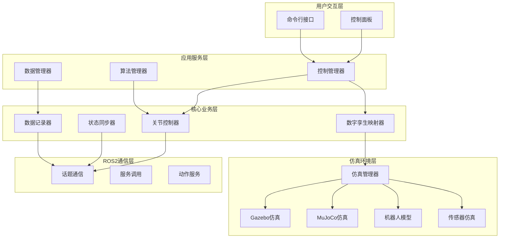

# 轮腿机器人孪生控制系统设计文档

## 概述

轮腿机器人孪生控制系统是一个基于ROS2的仿真控制平台，采用模块化架构设计，核心创新在于基于URDF的轮腿混合运动数字孪生映射器。系统通过Gazebo物理仿真环境实现机器人的数字孪生，支持多种控制算法验证，为轮腿机器人控制理论研究提供完整的实验平台。

## 系统架构

系统采用分层模块化架构，主要包含以下层次：



### 核心组件说明

1. **数字孪生映射器 (Digital Twin Mapper)**: 核心创新模块，处理轮腿混合运动的运动学映射
2. **关节控制器 (Joint Controller)**: 负责关节位置控制和轨迹规划
3. **状态同步器 (State Synchronizer)**: 实现虚实状态同步的仿真版本
4. **控制管理器 (Control Manager)**: 协调各模块工作，管理系统状态
5. **算法管理器 (Algorithm Manager)**: 支持多种控制算法的动态加载和切换
6. **仿真管理器 (Simulation Manager)**: 统一管理Gazebo和MuJoCo仿真后端

## 组件与接口

### 数字孪生映射器 (Digital Twin Mapper)

**职责**: 解决轮腿机器人闭环机构在URDF中的近似表达与控制映射问题

**核心接口**:
```python
class DigitalTwinMapper:
    def parse_urdf_constraints(self, urdf_path: str) -> ConstraintModel
    def build_kinematic_model(self, constraint_model: ConstraintModel) -> KinematicChain
    def joint_to_task_mapping(self, joint_angles: np.ndarray) -> TaskSpaceState
    def task_to_joint_mapping(self, task_state: TaskSpaceState) -> np.ndarray
    def validate_motion_consistency(self, joint_state: JointState) -> ValidationResult
    def handle_singular_configuration(self, jacobian: np.ndarray) -> np.ndarray
```

**关键算法**:
- 轮腿耦合约束识别算法
- 双向运动学求解器
- 奇异位形处理机制
- 运动一致性验证

### 关节控制器 (Joint Controller)

**职责**: 实现精确的关节位置控制和轨迹跟踪

**核心接口**:
```python
class JointController:
    def set_joint_positions(self, positions: Dict[str, float]) -> bool
    def get_joint_states(self) -> JointState
    def execute_trajectory(self, trajectory: JointTrajectory) -> bool
    def set_control_gains(self, gains: ControlGains) -> None
    def emergency_stop(self) -> None
```

**控制算法支持**:
- PID位置控制
- 轨迹插值算法
- 关节限制处理
- 安全监控机制

### 算法管理器 (Algorithm Manager)

**职责**: 支持多种控制算法的集成和验证

**核心接口**:
```python
class AlgorithmManager:
    def register_algorithm(self, name: str, algorithm: ControlAlgorithm) -> bool
    def switch_algorithm(self, algorithm_name: str) -> bool
    def get_rl_environment(self) -> gym.Env
    def configure_lqr_controller(self, A: np.ndarray, B: np.ndarray, Q: np.ndarray, R: np.ndarray) -> LQRController
    def load_custom_algorithm(self, algorithm_path: str) -> ControlAlgorithm
```

**支持的算法类型**:
- 强化学习算法 (符合OpenAI Gym接口)
- LQR线性二次调节器
- 自定义控制算法
- 算法性能对比分析

### 仿真管理器 (Simulation Manager)

**职责**: 提供统一的仿真后端接口，支持Gazebo和MuJoCo的无缝切换

**核心接口**:
```python
class SimulationManager:
    def set_backend(self, backend: str) -> bool  # "gazebo" or "mujoco"
    def load_robot_model(self, urdf_path: str) -> bool
    def step_simulation(self, dt: float) -> SimulationState
    def set_joint_positions(self, positions: Dict[str, float]) -> None
    def get_joint_states(self) -> JointState
    def get_sensor_data(self, sensor_name: str) -> SensorData
    def reset_simulation(self) -> None
    def enable_parallel_simulation(self, num_envs: int) -> bool
```

**后端特性对比**:
- **Gazebo**: 可视化友好、ROS2集成、适合原型开发
- **MuJoCo**: 高性能、高精度接触、适合RL训练和批量仿真
- **统一接口**: 相同的控制逻辑可在两个后端间无缝切换

### 状态同步器 (State Synchronizer)

**职责**: 模拟虚实状态同步过程，为硬件集成做准备

**核心接口**:
```python
class StateSynchronizer:
    def sync_virtual_state(self, virtual_state: RobotState) -> SyncResult
    def simulate_network_delay(self, delay_ms: int) -> None
    def calculate_sync_error(self, virtual_state: RobotState, real_state: RobotState) -> float
    def trigger_correction(self, error_threshold: float) -> bool
    def get_sync_quality_report(self) -> SyncQualityReport
```

### 控制面板 (Control Panel)

**职责**: 提供直观的用户交互界面

**核心功能**:
- 关节控制滑块
- 实时状态监控
- IMU数据可视化
- 算法切换界面
- 数据记录控制

**技术实现**: 基于PyQt5/PySide6或rqt插件

## 数据模型

### 机器人状态模型

```python
@dataclass
class RobotState:
    timestamp: float
    joint_positions: Dict[str, float]  # 关节位置
    joint_velocities: Dict[str, float]  # 关节速度
    joint_efforts: Dict[str, float]    # 关节力矩
    base_pose: Pose                    # 基座位姿
    imu_data: ImuData                  # IMU数据
    wheel_contacts: Dict[str, bool]    # 轮子接触状态

@dataclass
class ImuData:
    orientation: Quaternion
    angular_velocity: Vector3
    linear_acceleration: Vector3
    covariance: np.ndarray

@dataclass
class TaskSpaceState:
    base_position: Vector3
    base_orientation: Quaternion
    wheel_positions: Dict[str, Vector3]
    leg_end_positions: Dict[str, Vector3]
```

### 约束模型

```python
@dataclass
class ConstraintModel:
    wheel_constraints: List[WheelConstraint]
    leg_constraints: List[LegConstraint]
    coupling_constraints: List[CouplingConstraint]
    
@dataclass
class WheelConstraint:
    wheel_name: str
    contact_point: Vector3
    normal_vector: Vector3
    friction_coefficient: float
    
@dataclass
class CouplingConstraint:
    joint_names: List[str]
    constraint_matrix: np.ndarray
    constraint_type: str  # "holonomic" or "nonholonomic"
```

### 控制算法接口

```python
class ControlAlgorithm(ABC):
    @abstractmethod
    def compute_control(self, state: RobotState, target: TaskSpaceState) -> ControlCommand
    
    @abstractmethod
    def update_parameters(self, params: Dict[str, Any]) -> None
    
    @abstractmethod
    def get_performance_metrics(self) -> Dict[str, float]

@dataclass
class ControlCommand:
    joint_positions: Dict[str, float]
    joint_velocities: Dict[str, float]
    joint_efforts: Dict[str, float]
    execution_time: float
```

## 错误处理

### 错误分类

1. **系统级错误**
   - URDF文件损坏或缺失
   - ROS2节点通信失败
   - Gazebo仿真环境异常

2. **控制级错误**
   - 关节限制违反
   - 运动学奇异位形
   - 控制算法收敛失败

3. **数据级错误**
   - 传感器数据异常
   - 状态同步失败
   - 数据记录错误

### 错误处理策略

```python
class ErrorHandler:
    def handle_urdf_error(self, error: URDFError) -> RecoveryAction
    def handle_control_error(self, error: ControlError) -> RecoveryAction
    def handle_communication_error(self, error: CommunicationError) -> RecoveryAction
    def log_error(self, error: SystemError, context: Dict[str, Any]) -> None
    def trigger_safe_mode(self) -> None

@dataclass
class RecoveryAction:
    action_type: str  # "retry", "fallback", "safe_mode", "shutdown"
    parameters: Dict[str, Any]
    timeout: float
```

### 安全机制

1. **关节限制监控**: 实时检查关节角度、速度、力矩限制
2. **运动一致性验证**: 确保轮腿协调运动的物理可行性
3. **紧急停止机制**: 在检测到危险情况时立即停止所有运动
4. **状态恢复**: 系统异常后的自动状态恢复机制

## 测试策略

### 单元测试

**测试范围**:
- 数字孪生映射器的运动学计算
- 关节控制器的位置控制精度
- 状态同步器的同步误差计算
- 算法管理器的算法切换功能

**测试工具**: pytest + ROS2测试框架

### 集成测试

**测试场景**:
- 完整的机器人运动控制流程
- 多算法切换的稳定性测试
- 长时间运行的性能测试
- 异常情况的恢复测试

### 性能测试

**关键指标**:
- 仿真实时性 (≥50Hz)
- 控制延迟 (≤100ms)
- 内存使用稳定性
- CPU使用率优化

**测试方法**:
- 基准测试套件
- 压力测试场景
- 性能回归测试
- 资源使用监控

## 正确性属性

*属性是一个特征或行为，应该在系统的所有有效执行中保持为真——本质上是关于系统应该做什么的正式陈述。属性作为人类可读规范和机器可验证正确性保证之间的桥梁。*

基于需求分析，以下是系统的核心正确性属性：

### 属性 1: 关节系统完整性
*对于任何*有效的URDF机器人模型，系统加载后应该正确创建所有定义的关节，并且每个关节都能接收位置指令并执行相应运动
**验证需求: 需求 1.3, 2.1, 2.2**

### 属性 2: 关节限制约束遵守
*对于任何*关节运动指令，系统执行的实际关节角度应该始终在URDF定义的关节限制范围内
**验证需求: 需求 2.3**

### 属性 3: 关节状态反馈一致性
*对于任何*关节位置变化，系统应该发布相应的关节状态反馈，且反馈的位置值应该与实际关节位置一致
**验证需求: 需求 2.5**

### 属性 4: IMU数据物理一致性
*对于任何*机器人运动状态，IMU传感器生成的数据应该通过ROS2正确发布，且数据应该反映当前的物理状态变化
**验证需求: 需求 3.1, 3.2, 3.5**

### 属性 5: 状态同步系统完整性
*对于任何*机器人状态变化，状态同步器应该记录状态历史、模拟传输延迟、并计算虚实同步误差
**验证需求: 需求 5.1, 5.2, 5.3**

### 属性 6: 数据持久化格式正确性
*对于任何*数据记录操作，系统应该能够以正确的格式（ROS2 bag或CSV）保存数据，且保存的数据应该能够被正确读取
**验证需求: 需求 6.2, 6.5**

### 属性 7: 配置系统有效性验证
*对于任何*配置参数修改，系统应该验证参数的有效性，对于有效参数应用新设置，对于无效参数使用默认值
**验证需求: 需求 7.2**

### 属性 8: 数字孪生映射器运动学一致性
*对于任何*有效的轮腿机器人URDF，数字孪生映射器应该正确识别运动学约束、建立耦合关系模型、并实现关节空间与任务空间的双向转换
**验证需求: 需求 8.1, 8.2, 8.3**

### 属性 9: 轮腿协调运动一致性
*对于任何*轮腿协调运动指令，映射器应该确保运动的物理一致性，并能处理奇异位形而不导致系统失效
**验证需求: 需求 8.4**

### 属性 10: 算法管理器动态切换
*对于任何*已注册的控制算法，算法管理器应该支持动态加载和切换，且切换过程不应影响系统的稳定运行
**验证需求: 需求 10.1**

### 属性 11: 控制算法性能记录
*对于任何*运行中的控制算法，系统应该持续记录其控制性能指标，并能提供算法间的对比分析数据
**验证需求: 需求 10.5**

### 属性 12: 运动学双向转换往返一致性
*对于任何*有效的关节状态，执行关节空间到任务空间再到关节空间的双向转换后，应该得到等价的原始关节状态
**验证需求: 需求 8.3**

### 属性 13: 多仿真后端行为一致性
*对于任何*相同的控制输入和初始状态，在Gazebo和MuJoCo两种仿真后端中执行相同的运动序列应该产生一致的机器人行为
**验证需求: 需求 12.3**

### 属性 14: 仿真管理器接口统一性
*对于任何*仿真后端切换操作，仿真管理器应当提供统一的接口，使得上层控制逻辑无需修改即可在不同后端间切换
**验证需求: 需求 12.6**

## 测试策略

### 双重测试方法

系统采用单元测试和基于属性的测试相结合的方法：

- **单元测试**: 验证特定示例、边界情况和错误条件
- **属性测试**: 通过随机化输入验证通用属性
- 两者互补且都是全面覆盖所必需的

### 单元测试平衡

单元测试专注于：
- 演示正确行为的特定示例
- 组件间的集成点
- 边界情况和错误条件

属性测试专注于：
- 对所有输入都成立的通用属性
- 通过随机化实现全面的输入覆盖

### 基于属性的测试配置

- **测试库**: 使用Python的Hypothesis库进行基于属性的测试
- **最小迭代次数**: 每个属性测试至少100次迭代（由于随机化）
- **测试标记**: 每个属性测试必须引用其设计文档属性
- **标记格式**: **Feature: wheel-legged-robot-twin-control, Property {number}: {property_text}**
- **实现要求**: 每个正确性属性必须由单个基于属性的测试实现

### 测试环境配置

- **ROS2测试框架**: 使用launch_testing进行集成测试
- **Gazebo测试**: 使用headless模式进行仿真测试
- **性能测试**: 使用pytest-benchmark进行性能回归测试
- **覆盖率要求**: 核心模块代码覆盖率≥90%

### 测试数据管理

- **测试URDF**: 创建简化的测试机器人模型
- **模拟数据**: 生成各种测试场景的机器人状态数据
- **基准数据**: 维护算法性能基准数据集
- **回归测试**: 自动化回归测试套件